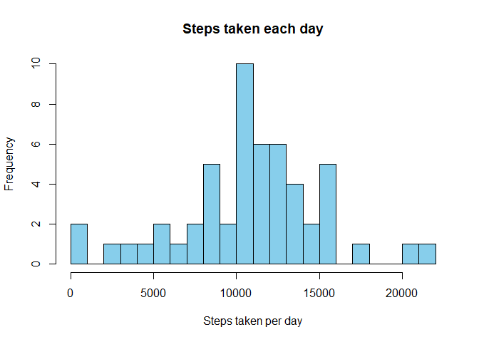
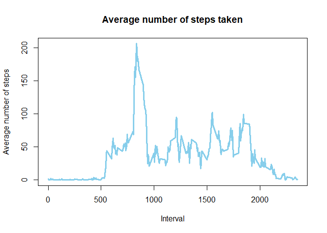
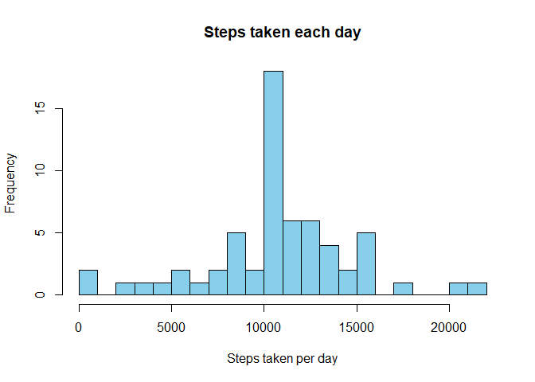
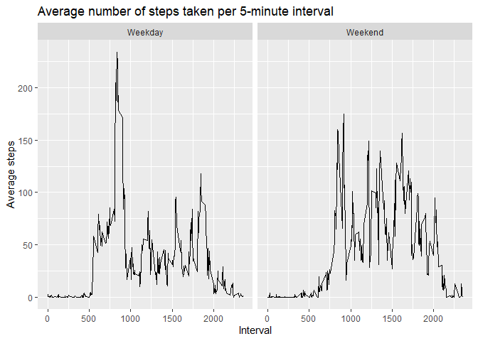

## Loading and preprocessing the data
### 1. Code for reading in the dataset and/or processing the data

```r
options(warn = -1)
unzip("activity.zip")
data <- read.csv("activity.csv")

summary(data)
```

```
##      steps            date              interval     
##  Min.   :  0.00   Length:17568       Min.   :   0.0  
##  1st Qu.:  0.00   Class :character   1st Qu.: 588.8  
##  Median :  0.00   Mode  :character   Median :1177.5  
##  Mean   : 37.38                      Mean   :1177.5  
##  3rd Qu.: 12.00                      3rd Qu.:1766.2  
##  Max.   :806.00                      Max.   :2355.0  
##  NA's   :2304
```

## What is mean total number of steps taken per day?

```r
dsteps <- aggregate(steps ~ date, 
                    data = data, 
                    FUN = sum, 
                    na.rm = TRUE)
head(dsteps)
```

```
##         date steps
## 1 2012-10-02   126
## 2 2012-10-03 11352
## 3 2012-10-04 12116
## 4 2012-10-05 13294
## 5 2012-10-06 15420
## 6 2012-10-07 11015
```
### 2. Histogram of the total number of steps taken each day

```r
hist(dsteps$steps, 
     xlab = "Steps taken per day", 
     ylab = "Frequency", 
     main = "Steps taken each day", 
     breaks = 25, 
     col = "skyblue")
```

<!-- -->

### 3. Mean and median number of steps taken each day

```r
meansteps <- mean(dsteps$steps, 
                  round = 2,
                  na.rm = TRUE)
mediansteps <- median(dsteps$steps, 
                      round = 2,
                      na.rm = TRUE)
```
Mean of the total number of steps taken per day: 1.0766189\times 10^{4}  
Median of the total number of steps taken per day: 10765


## What is the average daily activity pattern?
### 4. Time series plot of the average number of steps taken

```r
isteps <- aggregate(steps ~ interval, 
                     data = data, 
                     FUN = mean, 
                     na.rm = TRUE)
plot(isteps$interval, 
     isteps$steps, 
     xlab = "Interval", 
     ylab = "Average number of steps",
     main= "Average number of steps taken",
     col="skyblue",
     type="l",
     lwd = 3)
```

<!-- -->

### 5. The 5-minute interval that, on average, contains the maximum number of steps

```r
maxsteps <- isteps[which.max(isteps$steps), ]$interval
```
On average across all the days in the dataset, interval number 835 contains the maximum number of steps.

## Imputing missing values
### 6. Code to describe and show a strategy for imputing missing data

```r
missing <- sum(is.na(data$steps))
```
Total number of missing values in the dataset: 2304


```r
library(zoo)
```

```
## 
## Attaching package: 'zoo'
```

```
## The following objects are masked from 'package:base':
## 
##     as.Date, as.Date.numeric
```

```r
data2 <- subset(data, select = c(1))
data2 <- na.aggregate(data2)
data3 <- cbind(data[, 2:3], data2[,1])
```

The missing values in the dataset were filled with the mean value for that 5-minute interval.


```r
data3NAs <- sum(is.na(data3))
summary(data3)
```

```
##      date              interval          steps       
##  Length:17568       Min.   :   0.0   Min.   :  0.00  
##  Class :character   1st Qu.: 588.8   1st Qu.:  0.00  
##  Mode  :character   Median :1177.5   Median :  0.00  
##                     Mean   :1177.5   Mean   : 37.38  
##                     3rd Qu.:1766.2   3rd Qu.: 37.38  
##                     Max.   :2355.0   Max.   :806.00
```

The new dataset is equal the original dataset but with missing data filled in.  Now this dataset has 0 missing values.


### 7. Histogram of the total number of steps taken each day after missing values are imputed

```r
dsteps3 <- aggregate(steps ~ date, 
                    data = data3, 
                    FUN = sum, 
                    na.rm = TRUE)

hist(dsteps3$steps, 
     xlab = "Steps taken per day", 
     ylab = "Frequency", 
     main = "Steps taken each day", 
     breaks = 25, 
     col = "skyblue")
```

<!-- -->


```r
meansteps2 <- mean(data3$steps, 
                  round = 2,
                  na.rm = TRUE)
mediansteps2 <- median(data3$steps, 
                      round = 2,
                      na.rm = TRUE)
```
Mean of the total number of steps taken per day: 37.3825996  
Median of the total number of steps taken per day: 0

## Are there differences in activity patterns between weekdays and weekends?

### 8. Panel plot comparing the average number of steps taken per 5-minute interval across weekdays and weekends

```r
library(ggplot2)
data$date <- as.POSIXct(data$date, 
                        "%Y-%m-%d")
dayofweek <- weekdays(data$date)
data <- cbind(data, dayofweek)
```

```r
data$dtype <- sapply(data$date, 
                     function(x) {
    if (weekdays(x) == "sábado" | weekdays(x) =="domingo") 
    {y <- "Weekend"} else 
    {y <- "Weekday"}
    y
})
```

```r
data4 <- aggregate(steps ~ interval + dtype, data, mean, na.rm = TRUE)

ggplot(data4, aes(interval, steps)) + labs(x = "Interval", y = "Average steps", title = "Average number of steps taken per 5-minute interval") + geom_line() + facet_grid(~ dtype)
```

<!-- -->

### 9.All of the R code needed to reproduce the results (numbers, plots, etc.) in the report
